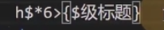

# 文本元素

html5中支持的元素: html5元素周期表

## h
h1～h6:一级标题到六级标题

## p
段落
>lorem 乱数假文，没有任何实际含义的文字

## span[无语义]
没有语言,仅用于设计样式
css必须承载在元素上
>以前：某些元素独占一行，某些元素不会
>现在：已经弃用

## pre
预格式化文本元素
空白折叠：在源代码中的连续空白字符（空格，换行，制表（tab））在显示中只会有一个空格
例外：在pre元素中的内容不会空白折叠
通常用于显示代码，外边套code元素。code元素代表代码区域
默认一个css属性
